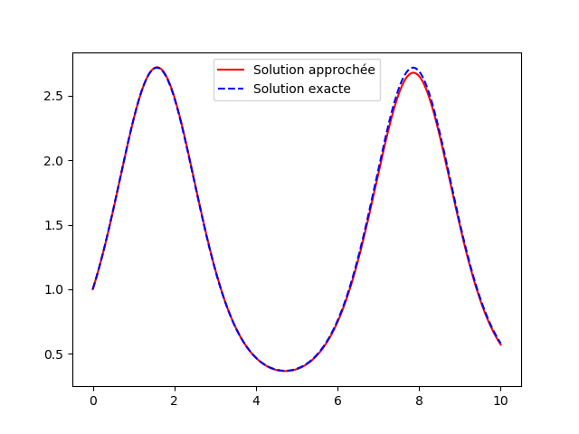
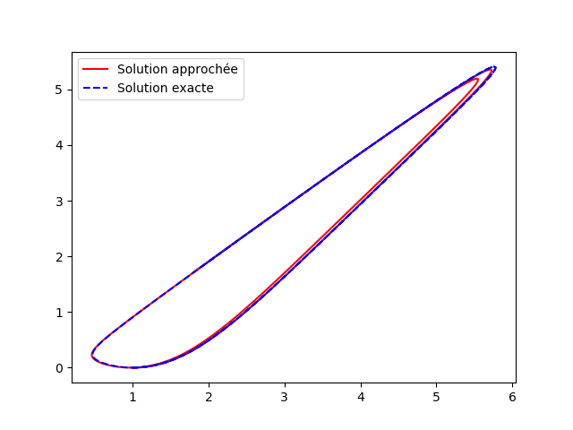
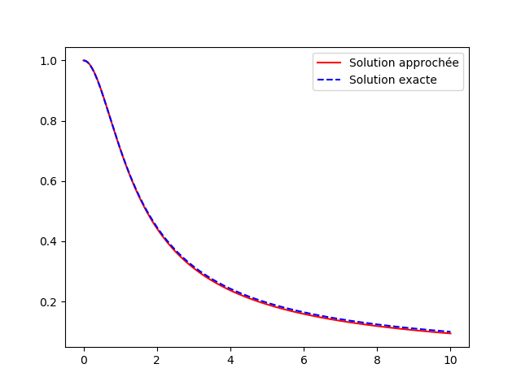

=================
Analyse numérique
=================

Statistiques
============

Le programme stipule que les étudiants doivent savoir calculer les éléments statistiques simples d'une liste de nombres : **moyenne** et **variance**.

Le calcul de la moyenne est on ne peut plus simple : il s'agit de la somme des éléments de la liste divisée par le nombre d'éléments de cette liste. De manière plus formmelle, la moyenne :math:`m` d'une liste :math:`(x_1,\dots,x_n)` de nombres est

.. math::

    m=\frac{1}{n}\sum_{k=1}^nx_k

.. ipython:: python

    def moyenne(liste):
        somme = 0
        for el in liste:
            somme += el
        return somme / len(liste)

    moyenne([1, 2, 3])

Evidemment, Python dispose déjà deux fonctions permettant de calculer aisément la moyenne d'une liste de nombres. On peut par exemple utiliser la fonction :code:`sum` qui, comme son nom l'indique, calcule la somme des éléments d'une liste (ou plus généralement d'un objet de type itérable).

.. ipython:: python

    moyenne = lambda liste: sum(liste) / len(liste)

    moyenne([1, 2, 3])

Le module :code:`numpy` dispose même d'une fonction :code:`mean` (*moyenne* en anglais).

.. ipython:: python

    from numpy import mean

    mean([1, 2, 3])

On peut donner deux expressions de la variance :math:`v` d'une liste :math:`(x_1,\dots,x_n)` de nombres dont on dispose déjà de la moyenne :math:`m`.

.. math::

    v = \left(\frac{1}{n}\sum_{k=1}^nx_k^2\right)-m^2 = \frac{1}{n}\sum_{k=1}^n(x_k-m)^2

En utilisant la première expression, on peut par exemple donner cette fonction de calcul de la variance.

.. ipython:: python

    def variance(liste):
        s1, s2 = 0, 0
        n = len(liste)
        for el in liste:
            s1 += el
            s2 += el * el
        return s2 / n - (s1 / n) ** 2

    variance([1, 2, 3])

On peut également utiliser une des fonctions de calcul de moyenne définies précédemment.

.. ipython:: python

    variance = lambda liste: moyenne([el ** 2 for el in liste]) - moyenne(liste) ** 2

    variance([1, 2, 3])

Si l'on préfère, on peut également utiliser la deuxième expression de la variance.

.. ipython:: python

    def variance(liste):
        m = moyenne(liste)
        return moyenne([(el - m) ** 2 for el in liste])

    variance([1, 2, 3])

Bien entendu, le module :code:`numpy` dipose déjà d'une fonction ad hoc : la fonction :code:`var`.

.. ipython:: python

    from numpy import var

    var([1, 2, 3])

Résolution d'équations par dichotomie
=====================================

Il s'agit ici de calculer une *valeur approchée* d'une solution d'une équation du type :math:`f(x)=0`. On ne cherche pas à obtenir une expression exacte d'une telle solution, ce qui est de toute façon évidemment impossible de manière générale.

On suppose qu'on dispose d'une fonction :math:`f` continue et strictement monotone sur un intervale :math:`[a,b]` vérifiant :math:`f(a)f(b)\leq0`. Le théorème des valeurs intermédiaires garantit l'existence d'une unique solution à l'équation :math:`f(x)=0` sur l'intervalle :math:`[a,b]`. Pour obtenir une *valeur approchée* de cette solution, on procède par **dichotomie** :

    1. On calcule :math:`c=(a+b)/2` et :math:`f(c)`.
    2. Si :math:`f(a)f(c)\leq0`, la solution appartient à l'intervalle :math:`[a,c]`. Sinon, elle appartient à l'intervalle :math:`[c,b]`.
    3. Dans le premier cas, on remplace :math:`b` par :math:`c` tandis que dans le second cas, on remplace :math:`a` par :math:`c`.
    4. On répète les étapes 1., 2. et 3. tant que la longeur de l'intervalle :math:`[a,b]` est supérieur à une précision :math:`\epsilon` donnée.
    5. La valeur de :math:`c` est alors une valeur appochée de la solution de :math:`f(x)=0` à :math:`\epsilon/2` près.

.. .. raw:: html
..    :file: _static/html/dichotomie.html

.. ipython:: python

    def dicho(f, a, b, eps):
        while abs(b-a) > eps:
            c = (a + b) / 2
            if f(a) * f(c) <= 0:
                b = c
            else:
                a = c
        return (a+b) / 2

    from math import sin
    dicho(sin, 2, 4, .0001)

Il est à remarquer que le module :code:`scipy` dispose déjà de fonctions pouvant résoudre de manière approchée des équations du type :math:`f(x)=0`.

.. ipython:: python

    from scipy.optimize import fsolve
    from math import cos

    f = lambda x: cos(x**2)
    x0 = fsolve(f, 0)
    x0
    f(*x0)

Calcul d'intégrales
===================

On expose ici des algorithmes de calcul *approché* d'intégrales [#quad]_. A nouveau, on ne cherche pas à obtenir des expressions exactes de ces intégrales.

Méthode des rectangles
----------------------

On peut approcher une intégrale par une somme d'aire de rectangles comme l'indique la figure suivante.

.. .. raw:: html
..    :file: _static/html/rectangles.html

Plus précisément, en posant :math:`x_k=a+k(b-a)/n` où :math:`n` désigne le nombre de rectangles :

.. math::

    \begin{align*}
    R_n&=\frac{b-a}{n}\sum_{k=0}^{n-1}f(x_k)\approx\int_a^bf(t)\,\mathrm{dt}&\text{(rectangles verts)}\\
    S_n&=\frac{b-a}{n}\sum_{k=1}^nf(x_k)\approx\int_a^bf(t)\,\mathrm{dt}&\text{(rectangles rouges)}
    \end{align*}

On peut alors proposer la fonction suivante pour approcher l'intégrale d'une fonction :math:`f` sur un intervalle :math:`[a,b]`.

.. ipython:: python

    def rectangles(f, a, b, N, side):
        pas = (b-a) / N
        x = a
        somme = 0
        for _ in range(N):
            if side:
                somme += f(x)
            x += pas
            if not side:
                somme += f(x)
        return somme / N

    rectangles(lambda x: x**2, 0, 1, 100, True)
    rectangles(lambda x: x**2, 0, 1, 100, False)

Les sommes :math:`R_n` et :math:`S_n` sont appelées des *sommes de Riemann* et on peut même prouver que pour une fonction :math:`f` continue,

.. math::
    \lim_{n\to+\infty}S_n=\lim_{n\to+\infty}T_n=\int_a^bf(t)\,\mathrm{dt}

En particulier, l'appoximation de l'intégrale :math:`\int_a^bf(t)\,\mathrm{dt}` est d'autant meilleure que le nombre :math:`n` de rectangles est grand, ce qui se conçoit très bien géométriquement.[#erreur_arrondi_integrale]_

Méthode des trapèzes
--------------------

On peut également apporcher une intégrale comme une somme d'aires de trapèzes comme sur la figure suivante. Bien évidemment, l'approximation de l'intégrale est meilleure qu'avec des rectangles.

.. .. raw:: html
..    :file: _static/html/trapezes.html

A nouveau, en posant :math:`x_k=a+k(b-a)/n` où :math:`n` désigne le nombre de trapèzes :

.. math::

    T_n=\frac{b-a}{n}\sum_{k=0}^{n-1}\frac{f(x_k)+f(x_{k+1})}{2}\approx\int_a^bf(t)\,\mathrm{dt}\\

On peut évidemment remarquer que :math:`T_n=(R_n+S_n)/2`. En fait, la somme précédente peut se réécrire de manière différente :

.. math::

    T_n=\frac{b-a}{n}\left(\frac{f(a)+f(b)}{2}+\sum_{k=1}^{n-1}f(x_k)\right)

Cette nouvelle formule permet de calculer :math:`T_n` en effectuant moins d'opérations qu'avec la formule précédente. On peut alors donner l'algorithme suivant.

.. ipython:: python

    def trapezes(f, a, b, N):
        pas = (b-a) / N
        x = a
        somme = (f(a) + f(b)) / 2
        for _ in range(N-1):
            x += pas
            somme += f(x)
        return somme / N

    trapezes(lambda x: x**2, 0, 1, 100)

.. todo:: Méthodes de quadrature

Résolution d'équations différentielles
======================================

L'objectif est de résoudre numériquement des équations différentielles : c'est-à-dire qu'on ne cherche pas des expressions explicites des solutions mais des valeurs approchées[#odeint]_.

Pour commencer, on traitera le cas de *problème de Cauchy* d'ordre 1.

.. math::

    \left\{
    \begin{aligned}
    y'&=f(t,y)\\
    y(t_0)&=y_0
    \end{aligned}
    \right.

On rappelle qu'un tel problème consiste en la donnée d'une équation différentielle résolue d'ordre 1 :math:`y'=f(t,y)` et d'une condition initiale :math:`y(t_0)=y_0`. Le théorème de Cauchy-Lipschitz garantit l'existence et l'unicité d'une solution à ce problème lorsque :math:`f` est suffisamment règulière.

L'idée est d'utiliser une approximation affine de la fonction solution : :math:`y(t+\Delta\!t)\approx y(t)+y'(t)\Delta\!t`. Le calcul de :math:`y'(t)` est possible grâce à l'équation différentielle si l'on connaît :math:`y(t)` puisque :math:`y'(t)=f(t,y(t))`. On itère ce processus pour calculer des valeurs approchées à des intervalles de temps réguliers. Plus précisément, en posant :math:`t_k=t_0+k\Delta\!t`, on a alors

.. math::

    \begin{alignat}{2}
    y(t_1) & \approx y(t_0)+y'(t_0)\Delta\!t & = y(t_0)+f(t_0,y_0)\Delta\!t &= y_1\\
    y(t_2) & \approx y(t_1)+y'(t_1)\Delta\!t & \approx y(t_1)+f(t_1,y_1)\Delta\!t &= y_2\\
    y(t_3) & \approx y(t_2)+y'(t_2)\Delta\!t & \approx y(t_2)+f(t_2,y_2)\Delta\!t &= y_3\\
    \dots
    \end{alignat}

La méthode que l'on vient de décrire porte le nom de **méthode d'Euler**.

.. ipython:: python

    def euler(f, t0, y0, pas, nb):
        t = t0
        y = y0
        liste_t = [t]
        liste_y = [y]
        for _ in range(nb):
            y += f(t, y) * pas
            t += pas
            liste_t.append(t)
            liste_y.append(y)
        return liste_t, liste_y

Par exemple, on calcule ici une solution approchée du système de Cauchy

.. math::

    \left\{
    \begin{aligned}
    y'&=\cos(t)y\\
    y(0)&=1
    \end{aligned}
    \right.

.. ipython:: python

    from math import cos
    f = lambda t, y: cos(t) * y
    liste_t, liste_y = euler(f, 0, 1, .01, 1000)

On peut tracer la courbe de la solution apporchée que l'on peut comparer à la courbe de la solution exacte. En effet, on montre sans peine que l'unique solution de cd problème de Cauchy est la fonction :math:`x\mapsto e^{\sin(x)}`.

.. ipython:: python

    import matplotlib.pyplot as plt
    from numpy import exp, sin, linspace

    plt.figure();

    # Tracé de la solution approchée
    plt.plot(liste_t, liste_y, color='red', label='Solution approchée');

    # Tracé de la solution exacte
    x = linspace(0, 10, 1000)
    y = exp(sin(x))
    plt.plot(x, y, '--', color='blue', label='Solution exacte');

    plt.legend();

    @suppress
    plt.savefig('_images/euler.png', width=10)
    plt.show()

Bien entendu, l'approximation affine :math:`y'(t+\Delta\!t)\approx f(t)+f'(t)\Delta\!t` est d'autant meilleur que :math:`\Delta\!t` est petit.

.. .. raw:: html
..    :file: _static/html/euler.html

On peut adapter la méthode au cas d'un système différentiel d'ordre 1. Soit par exemple à résoudre le système différentiel suivant.

.. math::

    \left\{
    \begin{aligned}
    x'&=\cos(t)x+\sin(t)y\\
    y'&=\sin(t)x+\cos(t)y\\
    (x(0),y(0))&=(1,0)
    \end{aligned}
    \right.

.. ipython:: python

    def euler(f, t0, X0, pas, nb):
        t = t0
        X = X0
        liste_t = [t]
        liste_X = [X]
        for _ in range(nb):
            X = [x + u * pas for x, u in zip(X, f(t, X))]
            t += pas
            liste_t.append(t)
            liste_X.append(X)
        return liste_t, liste_X

.. ipython:: python

    from math import cos, sin
    f = lambda t, X: [cos(t) * X[0] + sin(t) * X[1], sin(t) * X[0] + cos(t) * X[1]]
    liste_t, liste_X = euler(f, 0, [1, 0], .01, 1000)

.. ipython:: python

    import matplotlib.pyplot as plt
    from numpy import exp, sin, cos, sinh, cosh

    plt.figure();

    # Tracé de la solution approchée
    plt.plot(*zip(*liste_X), color='red', label='Solution approchée');

    # Tracé de la solution exacte
    t = linspace(0, 10, 1000)
    x = exp(sin(t)) * cosh(1 - cos(t))
    y = exp(sin(t)) * sinh(1 - cos(t))
    plt.plot(x, y, '--', color='blue', label='Solution exacte');

    plt.legend();

    @suppress
    plt.savefig('_images/euler_syst.png', width=10)
    plt.show()

On sait qu'il est toujours possible de ramener une équation différentielle scalaire d'ordre strictement supérieur à 1 à un système différentiel d'ordre 1.

Par exemple, si l'on désire résoudre le problème de Cauchy

.. math::

    \left\{\begin{aligned}
    y''+\frac{2t}{1+t^2}y'+\frac{1}{(1+t^2)^2}y&=0\\
    (y(0),y'(0))&=(1,0)
    \end{aligned}\right.

on peut se ramener au système différentiel d'ordre 1 suivant

.. math::

    \left\{\begin{aligned}
    y'&=z\\
    z'&=-\frac{2t}{1+t^2}z-\frac{1}{(1+t^2)^2}y\\
    (y(0),z(0))&=(1,0)
    \end{aligned}\right.

.. ipython:: python

    f = lambda t, X: [X[1], -X[0] / (1 + t**2)**2 - 2 * t / (1 + t**2) *X[1]]
    liste_t, liste_X = euler(f, 0, [1, 0], .01, 1000)

.. ipython:: python

    import matplotlib.pyplot as plt
    from numpy import sqrt

    plt.figure();

    # Tracé de la solution approchée
    plt.plot(liste_t, [X[0] for X in liste_X], color='red', label='Solution approchée');

    # Tracé de la solution exacte
    t = linspace(0, 10, 1000)
    y = 1/sqrt(1 + t**2)
    plt.plot(t, y, '--', color='blue', label='Solution exacte');

    plt.legend();

    @suppress
    plt.savefig('_images/euler_edl2.png', width=10)
    plt.show()

.. [#quad] Le module :code:`scipy.integrate` dispose déjà d'une fonction :code:`quad` à cet effet.

    .. todo:: Renvoyer vers le chapitre scipy/numpy

    .. ipython:: python

        from scipy.integrate import quad

        quad(lambda x:1/x**2, 1, 2)

    La fonction :code:`quad` renvoie un couple formé de l'approximation de l'intégrale et d'une majoration de l'erreur d'approximation.

.. [#erreur_arrondi_integrale] Il ne faut cependant pas crier victoire trop tôt. Tout d'abord, le temps de calcul augmente avec :math:`n`. De plus, chaque opération dans l'algorithme entraîne une erreur d'arrondi minime mais, le nombre d'opérations augmentant avec :math:`n`, le cumul de ces erreurs d'arrondi finit par dépasser le gain en précision lorsque :math:`n` est très grand.

.. [#odeint] Le module :code:`scipy.integrate` dispose déjà d'une fonction :code:`odeint` à cet effet.

    .. todo:: Renvoyer vers le chapitre scipy/numpy
