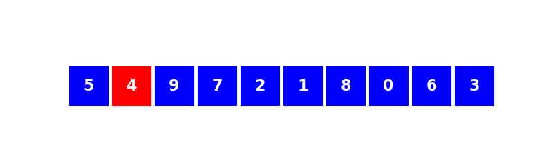

====
Tris
====

On décrit les algorithmes au programmme permettant de trier un tableau de valeurs numériques.

Tri par insertion
=================

Le principe est très simple : c'est l'algorithme qu'utilise naturellement l'être humain pour trier des objets coomme par exemple des cartes à jouer.

On procède en plusieurs étapes. On suppose qu'à l'étape :math:`i`, les éléments d'indice :math:`0` à :math:`i-1` du tableau sont déjà triés et on insère alors l'élément d'indice :math:`i` à sa place parmi les éléments précédents.

Un dessin vaut probablement mieux qu'un long discours.

.. ipython:: python

    @suppress
    %run ./scripts/tri_insertion.py

On peut alors proposer la fonction Python suivante.

.. ipython:: python

    def tri_insertion(tab):
        for i in range(1,len(tab)):
            val = tab[i]
            pos = i
            while pos > 0 and tab[pos - 1] > val:
                tab[pos] = tab[pos-1]
                pos -= 1
            tab[pos] = val

On vérifie qu'elle fonctionne bien sur quelques tableaux choisis aléatoirement.

.. ipython:: python

    from numpy.random import randint
    tab = randint(100, size=20)
    tab
    tri_insertion(tab)
    tab

.. todo :: preuve de l'algorithme + complexité

Tri rapide
==========

.. ipython:: python

    def tri_rapide(tab):
        if tab == []:
            return []
        else:
            pivot = tab[0]
            t1, t2 = [], []
            for x in tab[1:]:
                if x < pivot:
                    t1.append(x)
                else:
                    t2.append(x)
            return tri_rapide(t1) + [pivot] + tri_rapide(t2)

.. ipython:: python

    from numpy.random import randint
    tab = randint(100, size=20)
    tab
    tri_rapide(tab)

Tri par fusion
==============

.. ipython:: python

    def tri_fusion(tab):
        if len(tab) < 2:
            return tab
        else:
            m = len(tab)//2
            return fusion(tri_fusion(tab[:m]), tri_fusion(tab[m:]))

.. ipython:: python

    def fusion(t1, t2):
        i1, i2, n1, n2 = 0, 0, len(t1), len(t2)
        t=[]
        while i1 < n1 and i2 < n2:
            if t1[i1] < t2[i2]:
                t.append(t1[i1])
                i1 += 1
            else:
                t.append(t2[i2])
                i2 += 1
        if i1 == n1:
            t.extend(t2[i2:])
        else:
            t.extend(t1[i1:])
        return t

.. ipython:: python

    from numpy.random import randint
    tab = randint(100, size=20)
    tab
    tri_fusion(tab)
